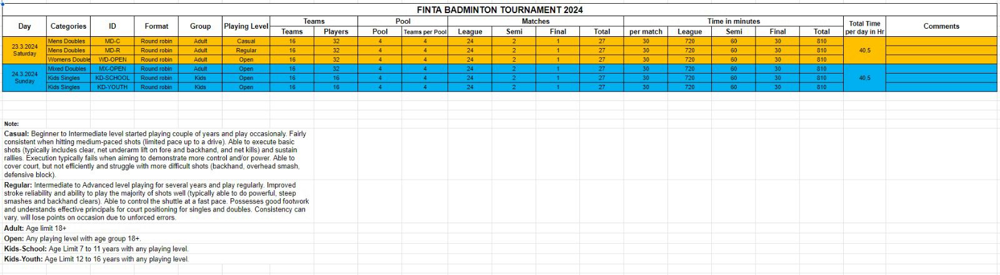

# FINTA Badminton Tournament - 2024

The “Badminton Tournament 2024” is being brought to the Tamil Community in Finland by the Finland Tamil Association (FINTA). This event is sponsored and is being organized by FINTA, in collaboration with J1 Club Ry.

## Game - Categories & Dates

### Day 1

Date: 23rd March  
Categories:  
Men's Doubles - Casual  
Mens' Doubles - Regular  
Women's Doubles - Open

### Day 2

Date: 24th March  
Categories:  
Mixed Doubles - Open  
Kid's Singles - 7 to 11 yrs  
Kid's Singles - 12 to 16 yrs

### Total Bookings

Time: 10 AM - 4 PM  
Available Time in Hours: 6 hours  
No of courts available: ?? **Needs to be checked**

Depending on which, number of teams needs to be decided for every category

### Drafted by FINTA

## Responsibilities

1. Rules, Software, Points, Tournament Matches (Draws), Updates to the playing matches(if any) - J1 Club Ry  
2. Main Umpires/Referee - J1 Club Ry (Need help from FINTA for more main umpires depending on the number of matches)  
3. Line Umpires/Referee - J1 Club Ry & FINTA (need volunteers from other team members)  
4. Main Administration Activties - FINTA & J1 Club Ry (this includes making the shuttlecock available per match, rackets if needed, any medicals, any issues related to booking, availability issues with teams etc.,)
5. any others  

## Registration

1. Game Registration can be done by J1 Club Ry using the 'Suomi Sports' Agreement.  
2. Cost needs to be decided  
3. Deadline for registration (date or **number of teams**)  
4. any others  

## Teams 

1. All the teams who are registered would get to know the details of their Pools, Matches, Rules available to them atleast 1 week before the tournament start  
2. A 'WhatsApp' group will be created for the participating teams and all communications will be done via chat  
3. The group will also have the representatives from J1 Club and FINTA  
4. any others  

## Things to check before the tournament

1. Possibility of using the Monitors, tables and chairs from 'Esports Center' to display tournament standings - J1 Club or FINTA
2. If Monitors not available, permission to use our own monitors - J1 Club or FINTA
3. Parking Spaces
4. Total Teams and Draws, Main Umpires (possible backups)
5. Permission to stick Banners
6. any others  

## On the Tournament Date

1. Arrival time for Organizing Team (J1 Club & FINTA) - 09:00 AM at Esports Center
2. Beverages - FINTA ?
3. Monitors, Laptop, Other Technical Equipments - J1 Club Ry
4. Badminton Shuttlecocks - FINTA ?  
   (All the above items needs to be available latest by 09:30 AM)
5. During the matches, crowd control needs to be done by both J1 Club and FINTA
6. any others  

## Qs

1. Total Number of courts available per day ?
2. Is it ok if we can conduct the semis and finals for every category on Day 2 ?
3. Will FINTA supply the shuttlecock for all the matches ?
4. If yes, What type (Plastic or Feather) ?
5. Is there any restrictions for the number of available shuttlecocks per match ?
6. Cost of registration for every category ?
7. Will there be any refreshments available - Cool Drinks, Juices, Banana etc., ?
8. Whether FINTA will handle the purchase of Medals/Trophies and how many ?
9. Who can take responsibility for printing of Banners ?
