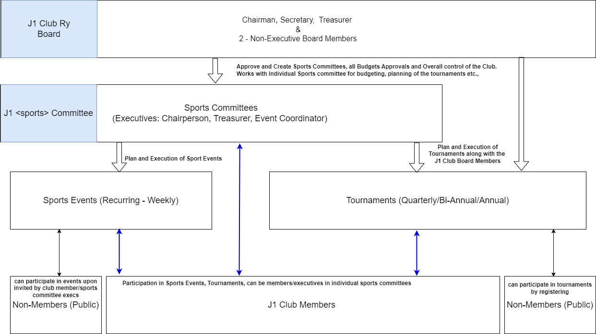

# J1 Sports

## Overview

This document provides a comprehensive overview of the governance model adopted in J1 Club Ry for the organization and conduct of sports events and tournaments.

## Organization Structure

## Events

Sports Events are sports activities that are regularly (recurrent) conducted every weekend. Mainly conducted for only the members of the club. Others can be invited as guests with approval from the individual sports committee

For event planning and booking, please check #Planning for a events

## Tournaments

An once in a year/bi-yearly/quarterly sports event, usually with a large number of participants including non-J1 club members.

For planning tournaments, please refer #Planning for a Tournament

## Organization Structure

### Board

'J1 Club Ry Board' is responsible for the overall direction and management of the club. It includes

1. Chairman,
2. Secretary,
3. Treasurer and
4. Two Non-Executive Members

### Committees

Each sports will have their own committee (sports committee) referred by 'J1 <> Committee' and there will be general committees (governance) for Finance, Marketing, Communication etc., to handle specific tasks.

NOTE

    Currently, committees for Finance, Marketing and Communication is not established and will be handled by the Board itself.

#### Sports Committees

1. Committee Formation: Each sport shall have its own dedicated committee.
2. Cross-Committee Membership: Members and Executives are permitted to serve on multiple committees, potentially in varying roles.
3. Rule Evaluation: The composition and structure of committees are subject to periodic review, contingent upon fluctuating levels of interest and participation in each sport.
4. Inclusivity of Sports: The governance model encompasses both indoor and outdoor sports activities.
5. Committee Threshold: A minimum of three (3) members needed to establish a sports committee.
6. Committee Creation Timing: Sports committees shall be formed either during the Annual General Meeting (AGM) or throughout the Monthly Board Meetings as needed.

Note

    Committee will be created in Suomisports (as groups) and the committee executives will be granted appropriate roles. It is mandatory to have the Board members as 'Admin' in all the committee.
    Committee can also be existing in WhatsApp or other preferred communication channels.

#### Roles and Responsibilities

Each committee should have atleast two or three executives for planning. There is no limit on the number of members

1. Chairperson - Overall responsible for operation of the committee, oversee all the operations such as budgetting, reviewing the composition and structure, raising alarms about the fluctuating interests in membership, events etc.,
2. Treasurer - responsible for planning, recording and managing the budget within the committee
3. Event Coordinator - responsible for the planning and execution of an event and tournament

NOTE

    If there are only two executives, the roles and responsibilities can be split among them

### Planning for an event

Chairperson can request for a booking for a recurring event, when there is enough interest for a particular sports. Chairperson can contact all the J1 members to find the interested members and can also regularly send notifications about the events. Upon having committment from the members, chairperson submits the request to the 'J1 Club Ry Board' for a recurring event booking in appropriate location.

Once the board approves the request and a booking is secured, the committee executives can then plan for the events.

#### Fees

#### Responsibilities

Chairperson and other executives of the sports committee have full responsibility of the securing the keys to the location, sports equipments, and all the facilities included in the premises. It is also mandatory for anyone of the executives to be present during the event. In event of non-availability, the keys or access to the location can be shared with a member but the chairperson and other executives share the overall responsibility.

All members/participants are required to follow the basic etiquettes and any special rules set by the committee. Depending upon the ease-of-use, the executives of the committee can decide to use either Suomisports or WhatsApp or Signal for the communication amoung the group.

### Planning for a Tournament

Chairperson or other executives of the committee can send a formal request to the Board, for planning and conducting a tournament. Board members (all) will work with the committee executives, analysing the interest shown, location availability, time and duration of the tournament, tournament fees (as applicable). Board members will have a exclusive meeting to discuss on the approval for conducting tournament. Once a majority (no voting, but just oral/written approval) is secured in favour of conducting the tournament, the information is then communicated to the sports committee executives.

Please visit the [J1 Tournaments Framework](https://j1clubry.github.io/j1club-docs-site/j1-tournaments/) for detailed information.
